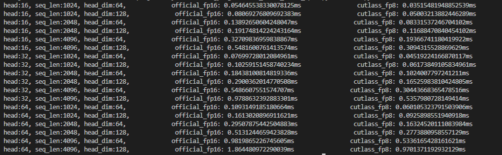

# cutlass_flash_atten_fp8
使用 cutlass 仓库在 ada 架构上实现 fp8 的 flash attention 

```
git submodule init
git submodule update
python setup.py install
python test.py
```



该代码也是在 https://github.com/66RING/tiny-flash-attention 基础上做的修改，
对应的 blog ：https://zhuanlan.zhihu.com/p/708867810
